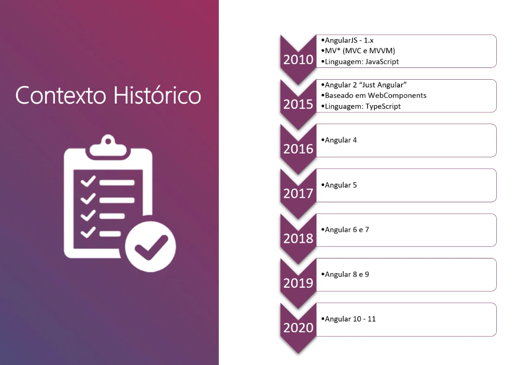
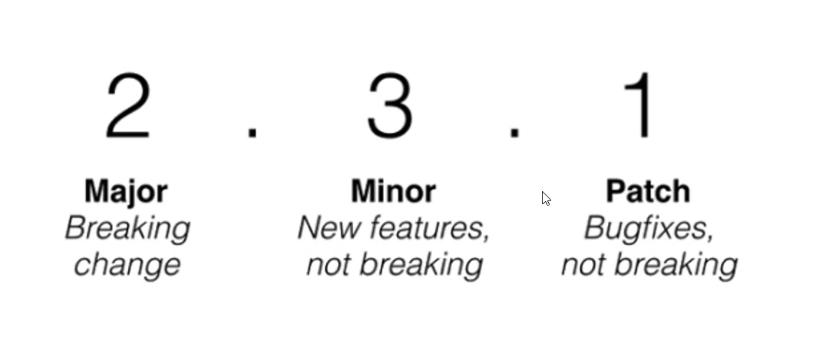
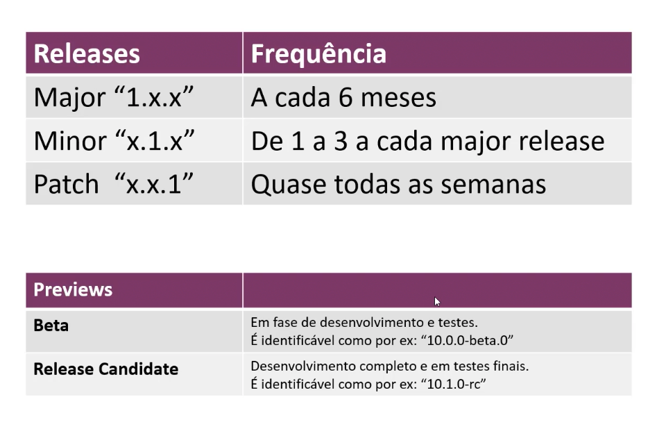
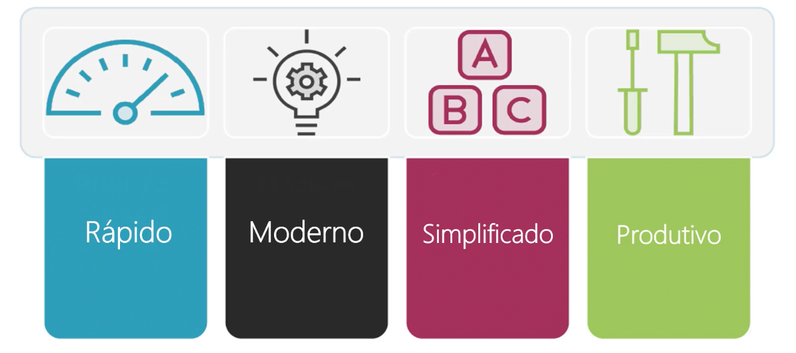
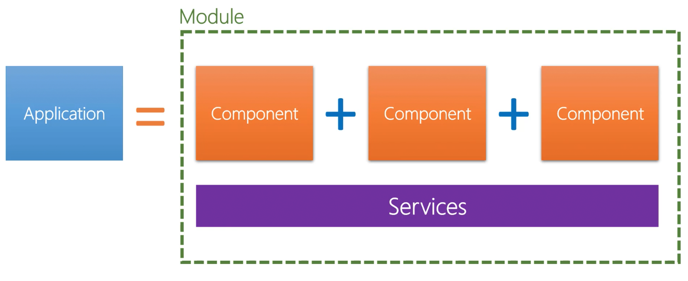
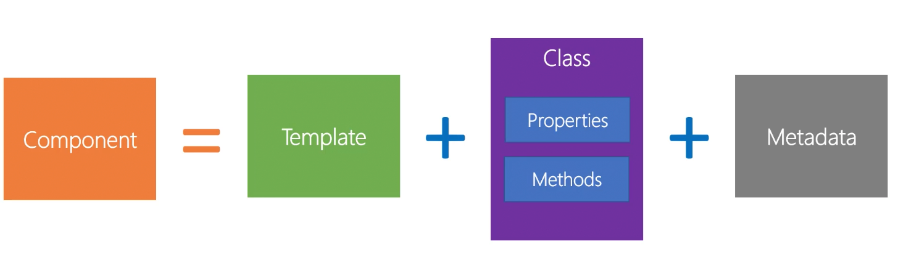
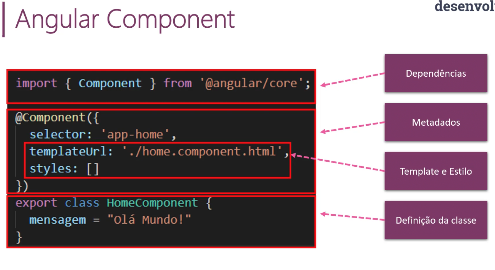

# Angular

## O que é o Angular?

* Um framework web, mobile e desktop.

----

## Contexto histórico

----

## Semantic Versioning

----

## Releases

----

## Por que Angular?

----

## Anatomia de um app Angular

> Baseado em componentes

----

----
