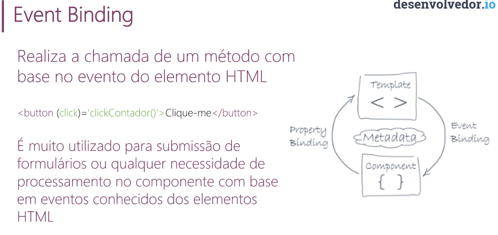

# Data binding(Formas de trabalhar com dados)

1. Interpolation
2. Property binding
3. Event Binding
4. Two-way binding

## 1. Interpolation

É a forma mais fácil de exibir um dado.
> O dado é representado no template por dois pares de chaves({{}}).

```HTML
<label> Nome: {{ meuDado }} </label>
```

----
## 2. Property Binding


----
## 3. Event Binding



## 4. Two-way Binding

Exibe e atualiza um dado nas duas direções (template, componente).

```HTML
<input [(ngModel)]="evento.nome" />
<label> Nome do evento: {{evento.nome}} </label> 
```

É a união de property-binding com event-binding.

**[()] = Banana in a box**

> Visualize uma Banana numa caixa para memorizar a sintaxe deste tipo de binding.