# **Elementos Angular**

# Elementos que serão abordados:

- Components
- Diretivas
- Rotas
- Pipes
- Observables
- Services

# 1- Componente

- O componente tem o seu próprio mundo. As alterações feitas nele não vai conflitar com os outros componentes.

  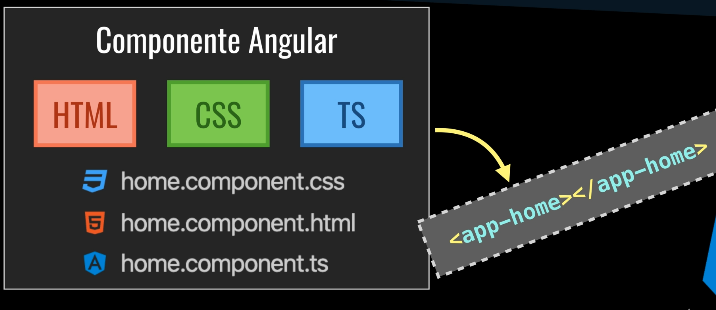

# 2- Diretivas

## Attribute Directives

- **Altera a aparência e o comportamento de um elemento, componente ou outra diretiva.**

  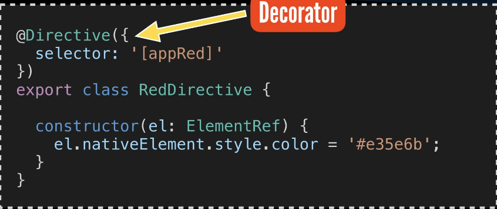

- **Decorator:** Objetivo de evitar herança e trabalhar com componetização(Vem sempre com um @)

**Exemplo:**

  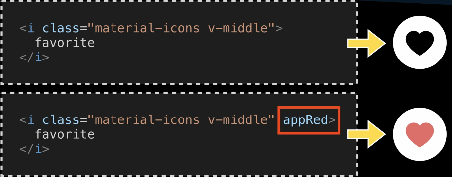

## Structural Directives

- Altera o layout adicionando e removendo elementos da DOM.
- As **Structural Directives** tem um ***(asterisco) na frente**!

**Exemplos:**

  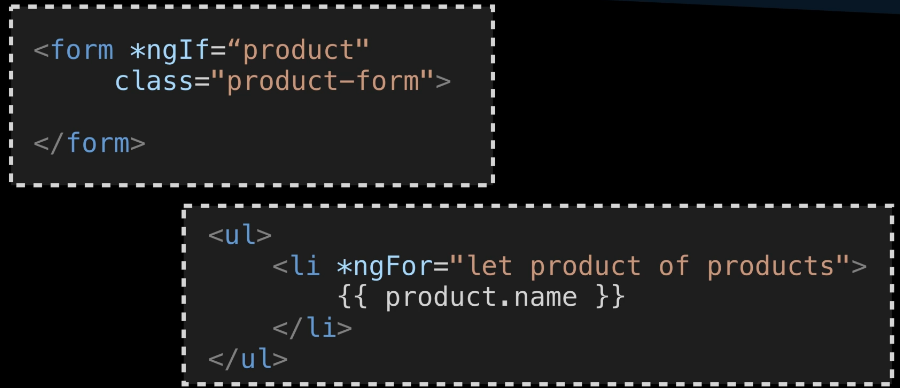

- No primeiro exemplo, só vai ser exibido o form se o product for true.
- No segundo exemplo, ele vai acrescentar novos elementos. Caso tenha 10 produtos, vai ser gerado 10 <li> com o product

## Property Binding

- Comunicação/ligação entre o HTML e TS, por meio do [].

**Exemplo:**

  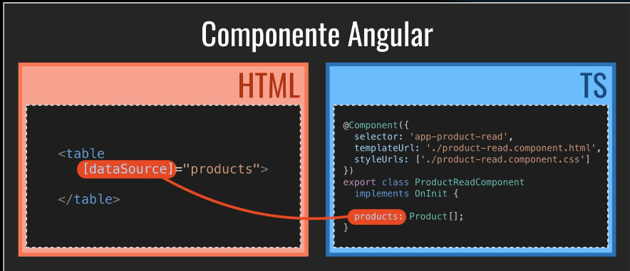

Quando eu coloco no meu html uma variável entre **[]**, eu estou dizendo que ela vai pegar o valor de products(nesse caso) lá no TS.
## Event Binding

- Comunicação/ligação entre o HTML e TS, por meio de ().

**Exemplo:**

  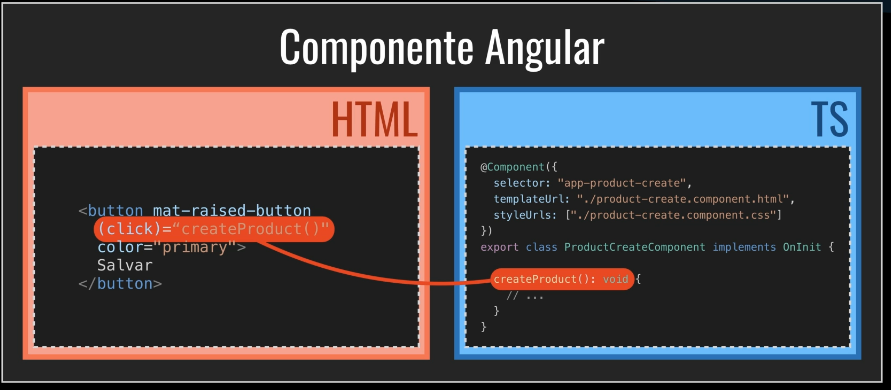

Quando o button for clicado, vai ser chamado o método "createProdutct()"
## Two Way Data Binding

- Automatizar o tráfego de dados entre a View(HTML) e o Model(TypeScript).

**Exemplo:**

  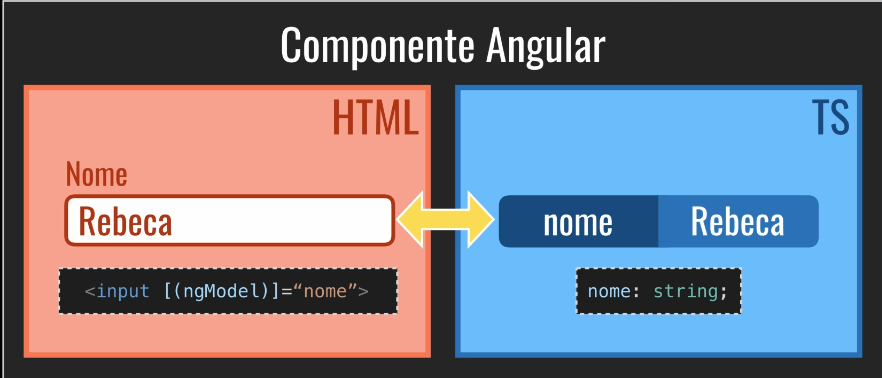

Se o Model muda, atualiza a View, e caso a View mude, atualiza o Model.
# 3- Rotas (Angular Router)

Quando queremos mudar de rotas, iremos mudar a url e os componentes.

  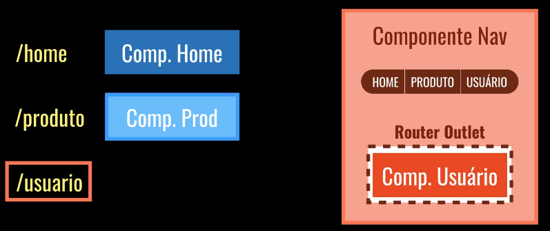

**Exemplo:**

  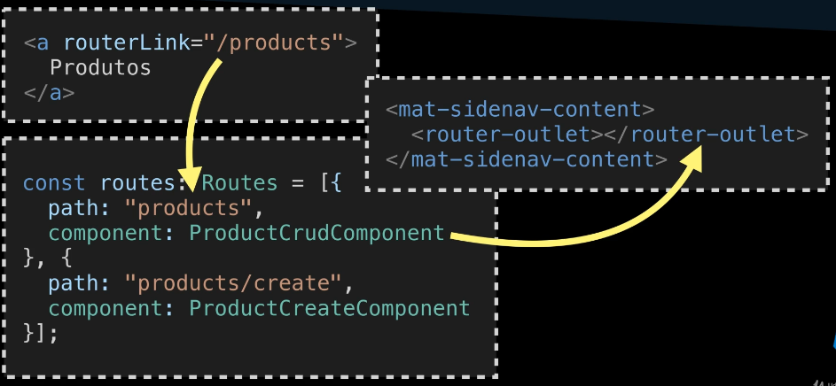

# 4- Pipes |

- Processamentos feitos encima de variavéis.

  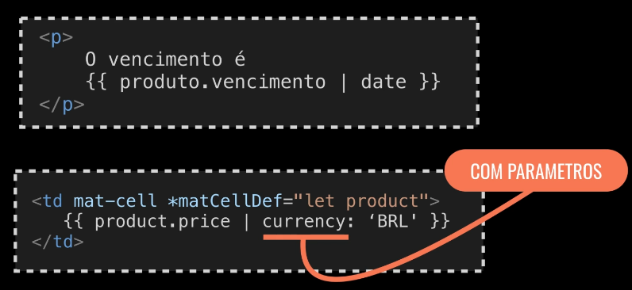

  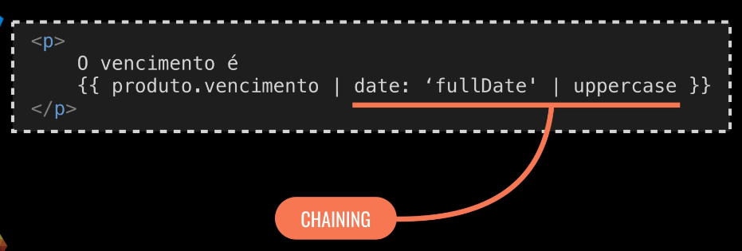

**Chaining - Encadeamento**

- No segundo exemplo, eu estou passando duas formatações para a variável.

# 5- Observables

- Programação Reativa - é um modelo de programação sobre fluxos de dados, potencialmente assíncronos, em combinação com consumo/roteamento de eventos e propagação de estado.

  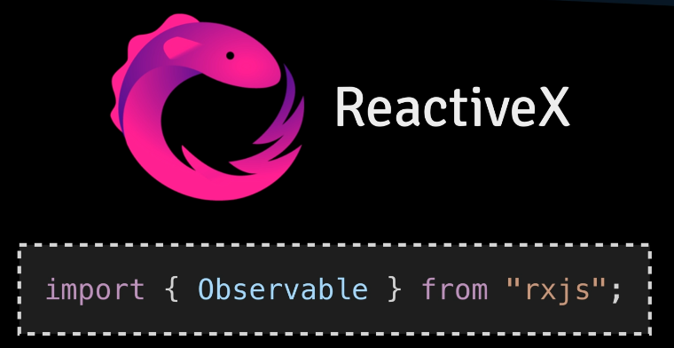

- **Padrão Observer** - Padrão de Projeto mais utilizado da web

- **Padrão orientado a Evento!**

  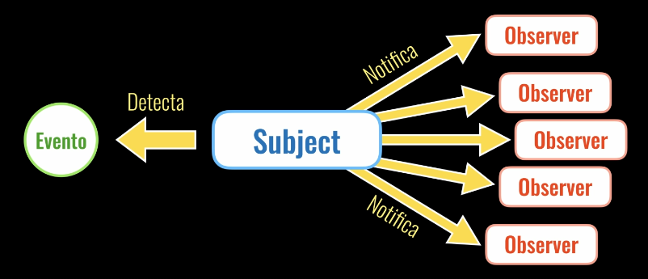

### Entendendo Observables

  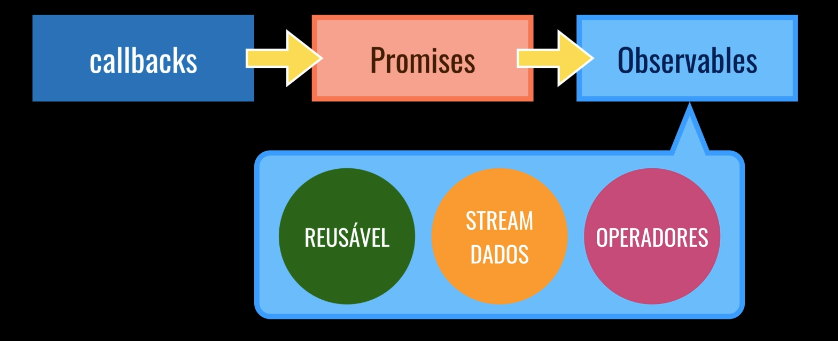

**Exemplo:**

  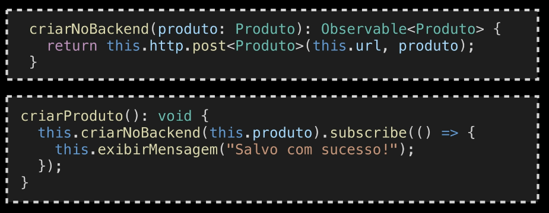

