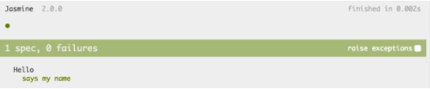
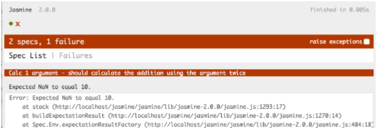
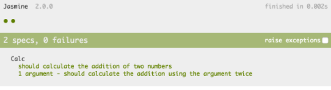

# Primeiros passos

## O que é Jasmine?

Jasmine é um ***framework behavior-driven development(BDD)*** para testar nossas features em Javascript. A sintaxe é bem intuitiva, o que faz com que escrever testes se torne uma tarefa fácil.

- BDD significa Desenvolvimento Orientado por Comportamento . O BDD é uma extensão do TDD onde, em vez de escrever os casos de teste , começamos escrevendo um comportamento . ... BDD é considerado uma prática recomendada quando se trata de testes automatizados , pois se concentra no comportamento do aplicativo e não em pensar na implementação do código
## Partiu praticar?

- Estrutura completa

```
├── jasmine (todos os arquivos do framework)
└── hello
    ├── hello.js
    └── spec
        ├── index.html
        └── hello.spec.js
```

- spec/index.html

```html
<!DOCTYPE html>
<html lang="en">
<head>
  <meta charset="UTF-8">
  <title>Jasmine</title>
  <link rel="shortcut icon" type="image/png" href="../../jasmine/lib/jasmine-2.0.0/jasmine_favicon.png">
  <link rel="stylesheet" type="text/css" href="../../jasmine/lib/jasmine-2.0.0/jasmine.css">

  <script type="text/javascript" src="../../jasmine/lib/jasmine-2.0.0/jasmine.js"></script>
  <script type="text/javascript" src="../../jasmine/lib/jasmine-2.0.0/jasmine-html.js"></script>
  <script type="text/javascript" src="../../jasmine/lib/jasmine-2.0.0/boot.js"></script>

  <script src="../hello.js"></script>
  <script src="hello.spec.js"></script>
</head>
<body>
</body>
</html>
```

- spec/hello.spec.js

```jsx
let Hello = function() {};

Hello.prototype.sayHi = function(name) {
  return 'my name is ' + name + ' and I\'m learning Jasmine!';
};
```

Observando o arquivo anterior, conseguimos já visualizar o que acontece. Mentalmente já esperamos que ao criarmos um objeto utilizando Hello e chamarmos o método sayHy, deve-se retornar uma string específica com o argumento que passarmos.

Passando para a parte testável da coisa, poderíamos implementar nosso teste assim:

```jsx
describe('Hello :)', function() {

  var hello = new Hello();

  it('says my name', function() {
    expect(hello.sayHi('Fabeni')).toEqual('my name is Fabeni and I\'m learning Jasmine!');
  });

});
```

Destrinchando nosso arquivo de teste:

- `describe` => é o que chamamos de suite. Seu nome, no caso *Hello*, geralmente define um componente da sua aplicação (pode ser uma classe, uma função ou qualquer outra coisa). Aceita 2 argumentos: uma string que é o nome da suite e uma função que é o bloco de código que implementamos o teste.
- `it()` => resumidamente, é uma função que diz o que um pequeno pedaço do seu componente deve fazer. No exemplo, demos uma descrição do teste (*says my name*), e esperamos (a analogia com o *expect*) que o método`sayHi`, quando chamado com o argumento *Fabeni*, retorne uma determinada *string* (*my name is Fabeni and I’m learning Jasmine!*).

Poderíamos também mudar algumas coisas na organização do código e adicionarmos a função **beforeEach**:

```jsx
describe('Hello :)', function() {

  var hello;

  beforeEach(function() {
    hello = new Hello();
  });

  it('says my name', function() {
    expect(hello.sayHi('Fabeni')).toEqual('my name is Fabeni and I\'m learning Jasmine!');
  });

});
```

A função **beforeEach**, como o próprio nome diz, roda uma vez antes de cada spec do describe. Também existe o **afterEach**, que tem o papel inverso e roda uma vez depois de cada spec.

Se abrirmos nosso **index.html** para rodarmos nossos testes, teremos algo assim:

<p align="center">
  
</p>

## Testes antes?

No exemplo anterior primeiro desenvolvemos nosso código e depois escrevemos nosso teste. No TDD ocorre o inverso: primeiro escreveríamos os testes e depois o nosso código. Achou estranho? Vamos tentar brincar.

Comecemos de algo básico: imagine que queremos ter uma função simples que aceita 2 números como argumentos e nos retorna o resultado da adição de ambos. Poderíamos fazer um teste simples assim:

```jsx
describe('Calc', function() {

  it('should calculate the addition of two numbers', function() {
    expect(add(5,3)).toEqual(8);
  });

  it('1 argument - should calculate the addition using the argument twice', function() {
    expect(add(5)).toEqual(10);
  });

});
```

No teste acima, quebramos nosso componente em 2 testes específicos:

- Primeiro esperamos que ao passarmos os números *5* e *3*, ele nos retorne *8*, fazendo a soma normalmente.
- Segundo, esperamos que se apenas um argumento for passado, esse argumento seja somado a ele mesmo, ou seja, se apenas o número *5* for passado, o resultado deve ser *10*, vindo da operação *5 + 5*.

**Obs.:** Poderíamos ter mais um monte de testes, como verificar se o argumento passado é realmente um número, mas deixemos apenas esses 2 para o exemplo.

Tendo isso em mente, podemos partir pro nosso código:

```jsx
function add(x, y) {
  return x + y;
}
```

Com certeza, de cara já poderíamos imaginar algo assim certo? No entanto, como é de se esperar, isso vai nos retornar um erro quando rodarmos os testes.

<p align="center">
  
</p>

Nossos testes quebraram e conseguimos ver exatamente onde: Calc 1 argument – should calculate the addition using the argument twice. Isso acontece pois não fizemos nenhum tratamento na nossa função, caso recebêssemos apenas um argumento. Vamos lá então:

```jsx
function add(x, y) {
  y ? return x + y; : return x + x;
}
```

Agora, se rodarmos os testes novamente:

<p align="center">
  
</p>

Referência:

[Brincando com Jasmine - iMasters - We are Developers](https://imasters.com.br/front-end/brincando-com-jasmine)