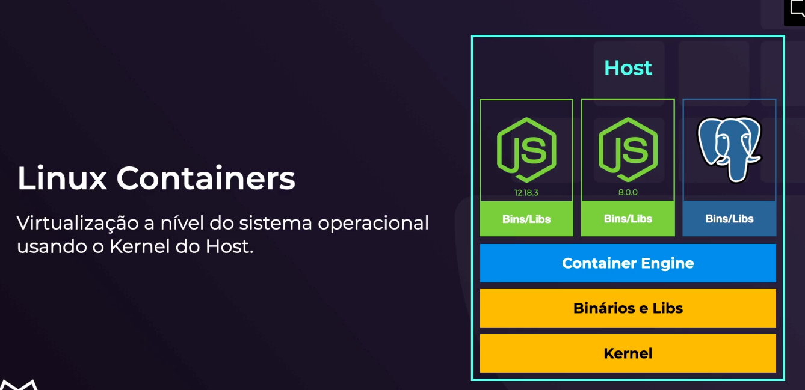

# Docker

De forma resumida, o Docker é uma plataforma de código aberto, desenvolvido na linguagem Go e criada pelo próprio Docker.Inc. Por ser de alto desempenho, o software garante maior facilidade na criação e administração de ambientes isolados, garantindo a rápida disponibilização de programas para o usuário final.

-----

## Mas e o **Docker**?
> Ele é a nossa container enginer

## Images Docker

* Define o que será executado dentro do container.
> Conseguimos baixar imagens prontas apartir do **docker hub**.

## Por que usar Containers?

* Aplicações rodam de forma isolada (não interferem uma na outra);
* Usa o mesmo Kernel da máquina base, tornando-se mais leve e eficiente quando comparado ás VMs tradicionais;
* Portabilidade