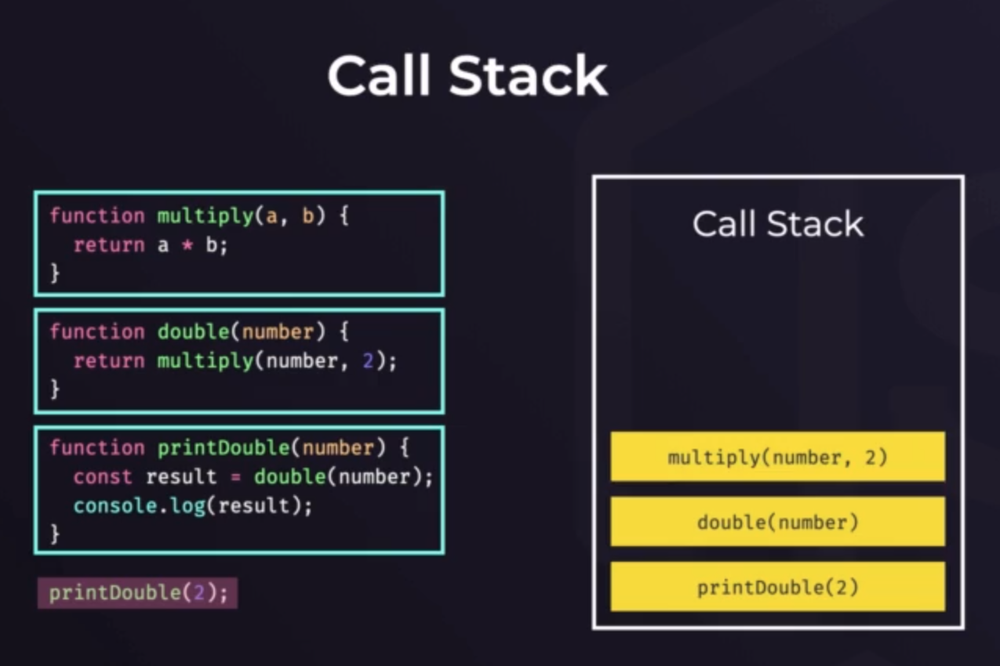

# NodeJS

## O que é?

* Plataforma que permite rodar JavaScript no servidor.

> **V8** - interpretador de código para JS.

## Call Stack - Pilha de processamento do código

> A primeira function que entra é a última a sair

## Single Thread

Isso significa que ele possui apenas uma **call stack**. Por isso, só consegue fazer uma coisa de cada vez.

> Como assim?
* Mas o node não é:
- Non-blocking I/O;
- Executa código assíncrono.
